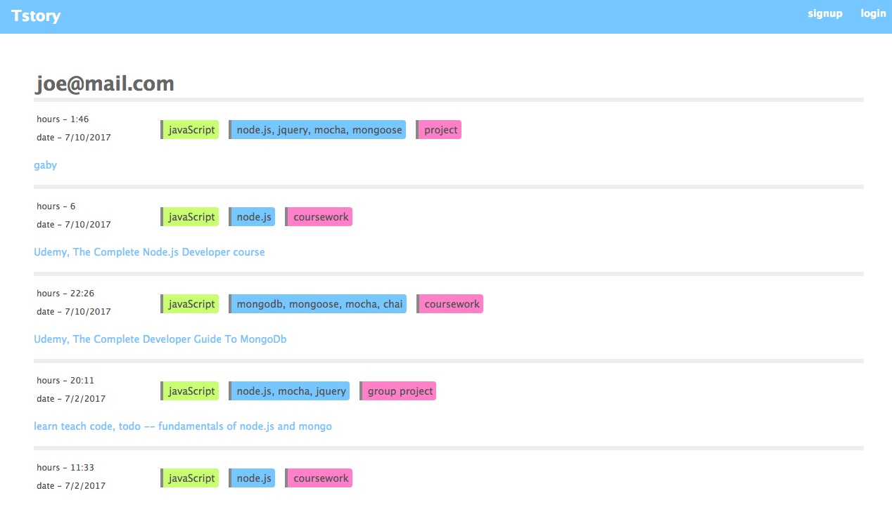

## Instructions

```
// create dummy data
npm run seed
```

```
// run dev environment
npm run dev
```

```
// testing, linting and security
npm run test
npm run test-watch

npm run lint
npm run lint-watch

npm run security-check
```



### Areas for improvement

Create user and administrator modes of authentication

Need to revisit the model associations between users and slips. Object reference vs embedded reference.

Rewrite the routes to act as a cleaner rest API serving json with ajax calls and fewer page redirects.

Implement feature allowing users to re-use previous slips and keep track of time on the site instead of just submitting time.

Model password not validating after implementing authentication
